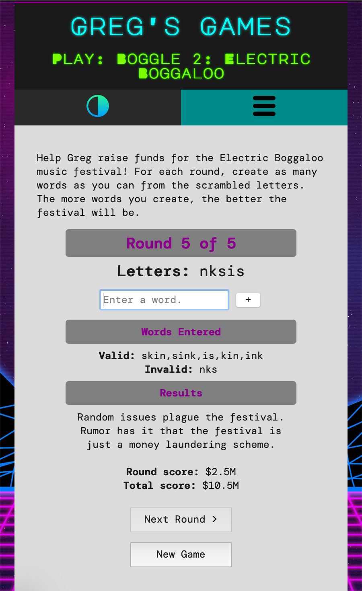

# gg_site

Greg's Games is a fictitious site made for a JavaScript course. It contains various games, uses cookies to set light/dark mode, and implements a responsive design with a mobile menu. This was a nice exercise in learning how to implement cookies, closure functions, and using JS to enhance site interactivity.

### Don't want to download a bunch of files to see how the site looks?

Here are some sample images from the actual site:

Desktop site with dark mode enabled

Game page on mobile with default light mode enabled

Game page on mobile with dark mode enabled
