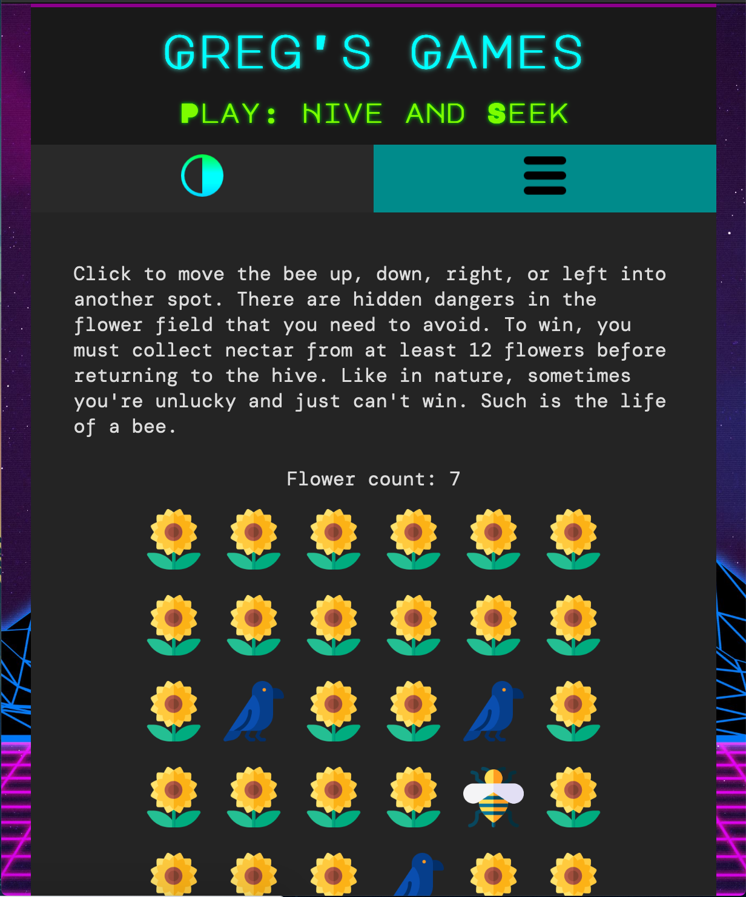

# gg_site

Greg's Games is a fictitious site made for a JavaScript course. It contains various games, uses cookies to set light/dark mode, and implements a responsive design with a mobile menu. This was a nice exercise in learning how to implement cookies, closure functions, and using JS to enhance site interactivity.

### Don't want to download a bunch of files to see how the site looks?

Here are some sample images from the actual site:

Desktop site (dark mode) 

Hive and Seek game on mobile (dark mode) 

Boggle 2 game on mobile (light mode) 

Game of 15 on mobile (light mode) 
